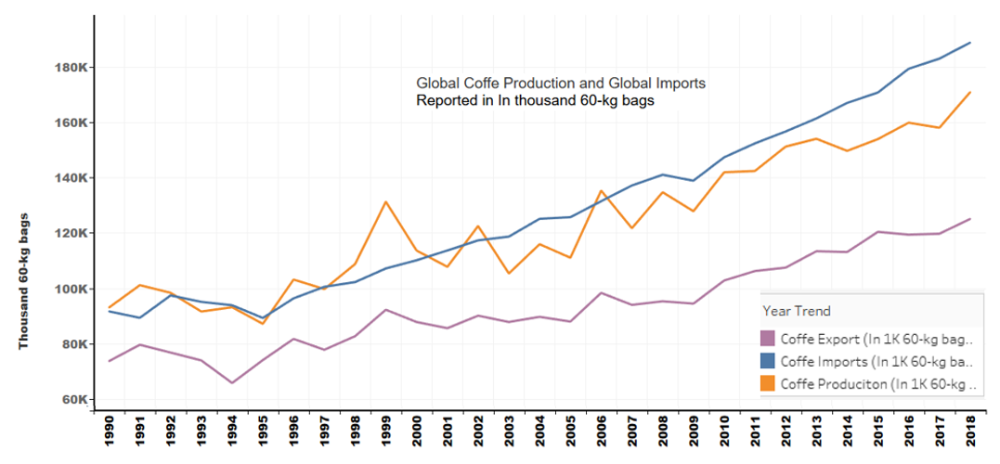
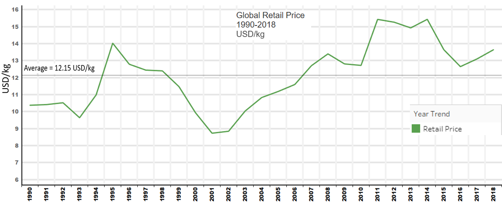
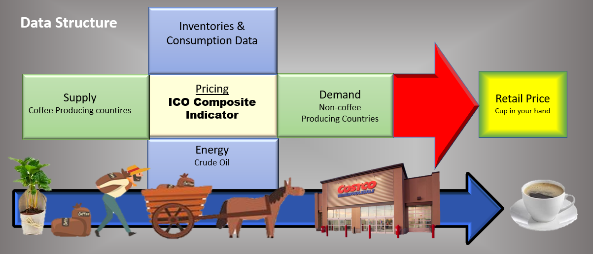
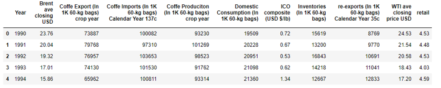
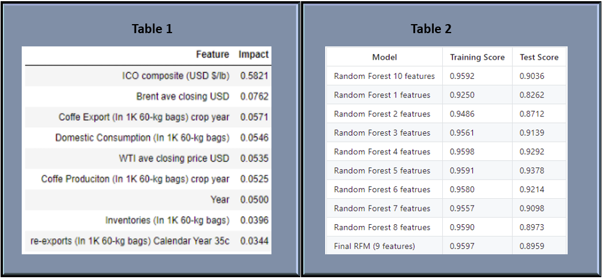
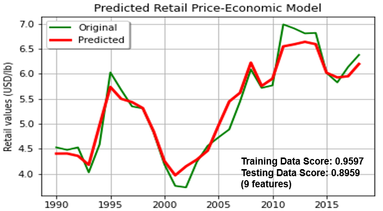

<b>

</b>

<h1><b>
Final Project Proposal: Group G
</b></h1>
<h3><b>
Contributors
</b></h3>
<h4><b>
Erik Fritzsche
</b></h4>
<h4><b>
Paul Hoogestraat
</b></h4>
<h4><b>
	Brent Sergent
</b></h4>

# Objective:

Identify key global economic trends to train a machine learning model for predicting the retail prices of coffee. Economic data considered will span from 1990 to 2018. The final model will attempt to predict the average global retail price for a pound of coffee.

### Questions to answer:
1.	How has the production of coffee changed (increased, decreased) from 1990 to 2018?
2.	What are the top 10 coffee producing countries from 1990 thru 2018?
3.	Have exports from coffee producing countries increased or decreased between 1990 and 2018?
4.	Have imports for coffee increased or decreased between 1990 and 2018?
5.	How has the price for coffee beans changed between 1990 and 2018?
6.	Do energy prices impact coffee prices?
7.	Can a machine learning model be developed to predict trending coffee prices?

# Background:
The International Coffee Organization (ICO) is a United Nations agency representing the world’s major coffee producers. This organization was founded in 1963 with the signing of the International Coffee agreement. In addition to representing interests of coffee producing nations, the organization hosts publicly available global economic data regarding supply, export, import, inventory, and pricing. A key metric created by this organization is the ICO composite indicator price, which is considered the benchmark for global coffee prices. The organization also provides global coffee retail prices which will be averaged to determine the retail price for a pound of coffee.

### Resources:
-	HTML/CSS/Bootstrap
-	JavaScript	
-	Python Pandas
-	Tableau
-	Machine learning library: Scikit-Learn
-	Heroku

### Process: 
- [x] Concept design and project planning.
- [x] Create Github Repository.
- [x] Evaluate and obtain data sources.
- [x] Transform data into visuals
  - [x] Chart depicitng top 10 coffee producers since 1990
  - [x] Chart depicting top 10 coffee importers since 1990
  - [x] Graph depicting exports and imports trends over time.
  - [x] Graph depicting price fluctuations in retail coffee price over time
  - [x] Map identifing coffee producing countries
  - [x] Map identifing coffee import countries  
- [x] Evalute, design, and deploy a machine learning model
  - [x] Model evaluated: Random Forest Regressor model (sklearn library)
  - [x] Model evaluated: Linnear regression model
  - [x] Model Optimized: Random Forest Regressor model
  - [x] Model Deployed: Random Forest Regressor model
- [X] Design a website with the following objectives:
  - [x] Frame objective. 
  - [x] Employ collected data to identify trends with viusuals.
  - [x] Create a vehical to demonstate outcome of machine learing model.
  - [x] Final analysis
  - [x] Refrences
- [x] Integrate Heroku:

# Data Sources
* [Kaggle: ICO Coffee Dataset (Worldwide)](https://www.kaggle.com/yamaerenay/ico-coffee-dataset-worldwide)

Data was obtained from ICO Coffee Dataset (Worldwide) hosted on Kaggle. This collection contained 13 csv files capturing distinct metrics regarding coffee economic data. Scope of files evaluated were: global production, global imports, inventories, prices-paid to growers, domestic consumption, and  retail prices.
<b>

</b>

* [International Coffee Organization: Historical Data on the Global Coffee Trade](http://www.ico.org/new_historical.asp)

Original data source employed on Kaggle site listed above. Provides additional detail regarding the data sets.

* [Macrotrends: Historic trends in Brent oil prices](https://www.macrotrends.net/2480/brent-crude-oil-prices-10-year-daily-chart)

Historic data regarding Brent crude prices.

* [Macrotrends: Historic trends in WTI oil prices](https://www.macrotrends.net/2516/wti-crude-oil-prices-10-year-daily-chart)

Historic data regarding WTI crude prices.
  
# Visualizations
Evaluated data was transformed into charts and interactive visualizations employing Tableau. Economic trends were identified from the visualizations and incorporated into designing a data structure for machine learning. Final visualizations were incorporated into the website and can also be located on the public Tableau website listed below in the references. Examples:
  
#### Graph A

  
#### Graph B

# Machine Learning

## Economic Model

Eleven data sets were organized into six categories (supply, demand, inventories, consumption, energy, ICO composite, and retail price). The data sets were composed of metric categories partitioned by year and country. Categories were averaged (i.e., price) or summed (i.e., crop production) by year for each feature category to obtain global benchmarks for analysis. Each category of data was treated equally. Ten features were initially selected to train a machine learning model.

#### Top Features
 

A random forest regressor model (sklearn library) was chosen over a linear regression model based on accuracy. Optimization of the model was evaluated by removing features with low training scores (Table 1). After exploring multiple combinations of features three models were created. The first model contained nine-features with the least impactful one removed. The second model included the ICO Composite and the year. The final model contained ISO composite, year, and Brent annual average. The last two models will be considered for web deployment due to simplicity considerations. Graph C contrasts the nine-feature model predicted global retail price vs observed global retail price. The three models were saved in this repository.

#### Feature Contribution

#### Graph C

## Environmental Model 

An additional model was considered to determine ICO composite pricing based on environmental factors combined with supply & demand.

<b>Machine Learning (with linear regression)</b>
* The model attempts to take the average of a year for all features and predict the average retail price of the importing countries
* The model fails due to the fluctuations and adjustments of the market are  not accurately taken into account by the yearly averages. The linear coefficients are just a maginifications of the data we kept at the exspense of the fluctuations.

# Website
A website was developed to communicate the results of this project. The objective was to identify coffee production and consumption trends by employing data visualizations for creating a machine learning model.

# Conclusion
Predicting global coffee retail prices from public data is a challenging endeavor. Initial data collected from Kaggle contained transcription errors in some data sets. Supplementing the Kaggle data with the original data from the ICO had an impact on modeling performance.  Selecting data representing the process of coffee bean production, weather, exporting, importing, pricing, and consumption was critical to developing a model. Each data category or feature was reported by country and year. These features were summed or averaged by year to create a representation of a global process for each category. This enabled the direct comparison of diverse data sets. The global retail price was predicted with machine learning model based on the composite of these global process. The data normalization process prevents the prediction of retail prices by country. This might be addressed in future models.

Linear regression and random forest regressor models were both evaluated for machine learning. The regressor model had training scores ranging from 0.92 to 0.96 depending on the number of features. The regressor model test scores had a corresponding range of 0.83 to 0.93.  The discrepancies between training and testing scores may imply overfitting of the model. This model also considered factors related to total global coffee bean production as a funciton of environmental factors influencing crop production. Harmonic tuning was not applied to this model. This may have increased the test scores.

The economic model was developed into an application that can be accessed via the website associated with this project. The models selected were based on the minimum number of features to simplify user interaction. The first model predicts global retail coffee price based ICO composite price and year (training score = 0.949, Test score 0.871). The second model also includes the annual average price of brent crude (training score = 0.956, Test score 0.914). Brent crude was identified as a key feature impacting accuracy. The intent of this feature was to incorporate energy prices into the model.

Predicting coffee prices is a challenging endeavor with complex factors to consider. This exercise has demonstrated it is possible to predict retail coffee prices based on historical data. Given more time, a more dynamic could be developed to predict prices with greater accuracy. 

# Refrences

### Articles
* [Predicting Coffee Prices (Nathan Mitchell)](https://ntmitchell.github.io/predicting-coffee-prices/)
* [A Beginners Guide to Random Forest Regression (Kirshni)](https://medium.datadriveninvestor.com/random-forest-regression-9871bc9a25eb)
* [Regression Example with RandomForestRegressor in Python](https://www.datatechnotes.com/2020/09/regression-example-with-randomforestregressor.html)

### Data
* [Kaggle: ICO Coffee Dataset (Worldwide)](https://www.kaggle.com/yamaerenay/ico-coffee-dataset-worldwide)
* [International Coffee Organization: Historical Data](http://www.ico.org/new_historical.asp)
* [Macrotrends: Historic trends in Brent oil prices](https://www.macrotrends.net/2480/brent-crude-oil-prices-10-year-daily-chart)
* [Macrotrends: Historic trends in WTI oil prices](https://www.macrotrends.net/2516/wti-crude-oil-prices-10-year-daily-chart)

### Graphs (Tableau)
* [Coffe Producer Country Data (Tableau)](https://public.tableau.com/profile/paul.hoogestraat#!/vizhome/coffe_prodiuction_2021P3/Dashboard1?publish=yes)
* [Coffe Import Country Data (Tableau)](https://public.tableau.com/profile/paul.hoogestraat#!/vizhome/Coffe_Import_2021P3/CoffeImport?publish=yes	)
* [Coffe Trend Data (Tableau)](https://public.tableau.com/profile/paul.hoogestraat#!/vizhome/coffe_trendlines_2021P3/coffe?publish=yes)

### Final Web site
* to be completed

### Price Predictor App
* [Global Retail Price](https://butler-final-project-group-g.herokuapp.com/)
            

