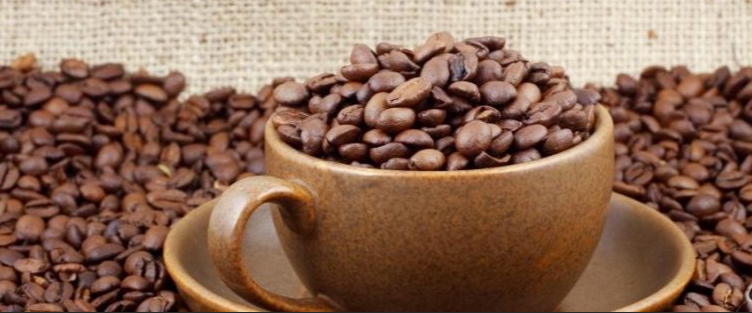

# <b>
Coffee Production and Consumption
</b>
<b>

</b>

<h3><b>
Final Project Proposal
</b></h3>
### <b>
Group G
</b>

*	Paul Hoogestraat
*	Brent Sergent
*	Erik Fritzsche

Topic: Coffee Production and Consumption
Source: https://www.kaggle.com/yamaerenay/ico-coffee-dataset-worldwide
As the global climate has started to significantly change over the last 30 years I wonder how this has impacted one of the most sensitive crops; coffee. Over the years there have been many articles speculating the impacts global warming will have on coffee production. In 2018, a specific article included coffee in the top five most sensitive crops. While coffee consumption in the U.S. has increased by 5% since 2015, I wonder how consumption has changed in other countries.

Questions to answer:
1.	How has the production of coffee changed (increased, decreased) from 1990 to 2018?
2.	What are the top 10 coffee producing countries from 1990 thru 2018?
3.	Have exports from coffee producing countries increased or decreased between 1990 and 2018?
4.	Have imports for coffee increased or decreased between 1990 and 2018?
5.	How has the price for coffee beans changed between 1990 and 2018?
6.	What are the main environmental changes that threaten coffee crops?

Visualizations:
1.	A map showing the coffee producing countries
2.	A chart showing the top 10 coffee producers since 1990
3.	A graph to show how exports and imports have changed by country since 1990
4.	A chart showing the change in the price of coffee beans since 1990
5.	A unique way to display the environmental elements that threaten coffee crops

Machine Learning (with clustering)
*	Using the historical export, consumption and trading/stock data for each country we can determine whether the future price of coffee beans would increase or decrease by country.
*	If the future price of coffee is increasing in the exporting countries, will there be a future price increase for coffee in the importing countries.
*	And vice versa, if the future price of coffee is decreasing in the exporting countries, will there be a future price decrease for coffee in the importing countries.

Proposed tasks:
Erik:
*	Web page
*	Find coffee bean data for 2019 and 2020 (to see how close the model predicts)

Brent:
*	Machine Learning

Paul:
*	Graphs in Tableau

## Refrences
### Data Sources

* [Kaggle: ICO Coffee Dataset (Worldwide)](https://www.kaggle.com/yamaerenay/ico-coffee-dataset-worldwide)

### Graphs (Tableau)
* [Coffe Producer Country Data (Tableau)](https://public.tableau.com/profile/paul.hoogestraat#!/vizhome/coffe_prodiuction_2021P3/Dashboard1?publish=yes)

* [Coffe Import Country Data (Tableau)](https://public.tableau.com/profile/paul.hoogestraat#!/vizhome/Coffe_Import_2021P3/CoffeImport?publish=yes	)

* [Coffe Trend Data (Tableau)](https://public.tableau.com/profile/paul.hoogestraat#!/vizhome/coffe_trendlines_2021P3/coffe?publish=yes)
