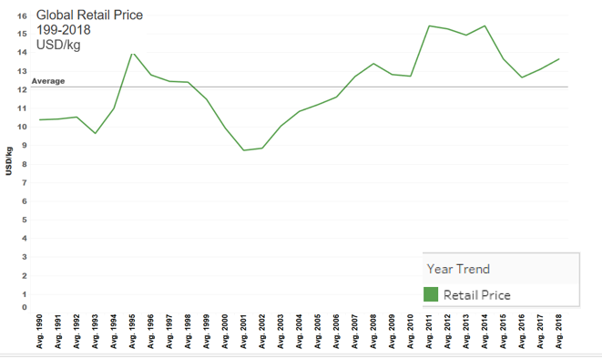
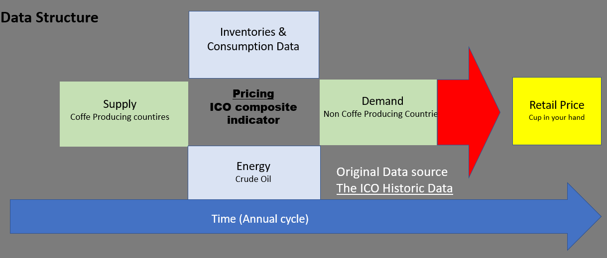
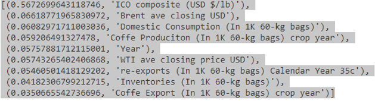
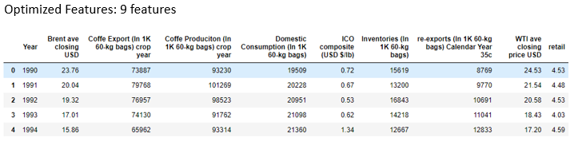
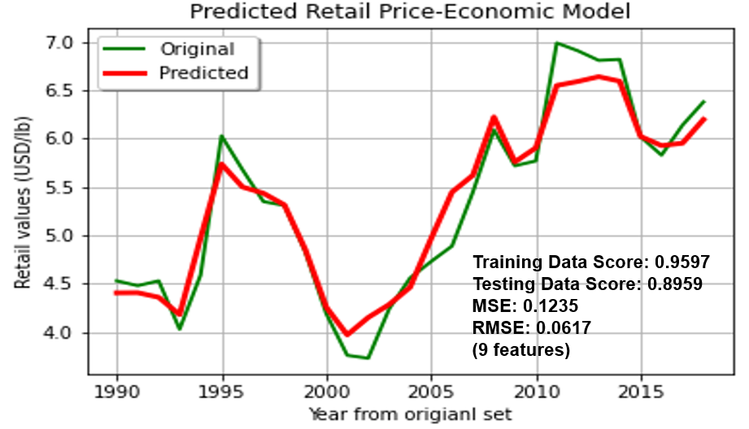

<b>

</b>

<h1><b>
Final Project Proposal: Group G
</b></h1>
<h3><b>
Contributors
</b></h3>
<h4><b>
Erik Fritzsche
</b></h4>
<h4><b>
Paul Hoogestraat
</b></h4>
<h4><b>
	Brent Sergent
</b></h4>

# Objective:

Identify key global economic trends to train a machine learning model for predicting retail prices of coffee. Economic data considered will span from 1990 to 2018. The final model should be able to predict the average global retail price for a pound of coffe.

### Questions to answer:
1.	How has the production of coffee changed (increased, decreased) from 1990 to 2018?
2.	What are the top 10 coffee producing countries from 1990 thru 2018?
3.	Have exports from coffee producing countries increased or decreased between 1990 and 2018?
4.	Have imports for coffee increased or decreased between 1990 and 2018?
5.	How has the price for coffee beans changed between 1990 and 2018?
6.	Do energy prices impact coffe prices?
7.	Can a machine learning model be developed to predict trending coffee prices?

# Background:
The International Coffe Organization (ICO) is a United Nations agency representing the worlds major coffee producers. This organization was founded in 1963 with the signing of the International Coffee agreement. In addition to representing interests of coffee producing nations, the organization hosts publicly available global economic data regarding supply, export, import, inventory, and pricing.  A key metric created by this organization is the ICO composite indicator price, which is considered the benchmark for global coffe prices. The organization also provides global coffe retail prices which will be averaged to determine the retail price of a cup of coffe.

### Resources:
-	HTML/CSS/Bootstrap
-	JavaScript	
-	Python Pandas
-	Tableau
-	Machine learning library: Scikit-Learn
-	Heroku

### Process: 
- [x] Concept design and project planning.
- [x] Create Github Repository.
- [x] Evaluate and obtain data sources.
- [x] Transform data into visuals
  - [x] Chart depicitng top 10 coffee producers since 1990
  - [x] Chart depicting top 10 coffee importers since 1990
  - [x] Graph depicting exports and imports trends over time.
  - [x] Graph depicting price fluctuations in retail coffee price over time
  - [x] Map identifing coffee producing countries
  - [x] Map identifing coffee import countries  
- [x] Evalute, design, and deploy a machine learning model
  - [x] Model evaluated: Random Forest Regressor model
  - [x] Model evaluated: Linnear regorso model
  - [x] Model Optimized: Random Forest Regressor model
  - [X] Model Deployed: Random Forest Regressor model
- [X] Design a website with the following objectives:
  - [ ] Frame objective. 
  - [ ] Employ collected data to identify trends with viusuals.
  - [ ] Create a vehical to demonstate outcome of machine learing model.
  - [ ] Final analysis
  - [ ] Refrences
- [ ] Integrate Heroku :

# Data Sources
* [Kaggle: ICO Coffee Dataset (Worldwide)](https://www.kaggle.com/yamaerenay/ico-coffee-dataset-worldwide)

Data was obtained from ICO Coffee Dataset (Worldwide) hosted on Kaggle. This collection contained 13 csv files capturing distinct metrics regarding coffee economic data. Scope of files evaluated were : global production, global imports, inventories, prices-paid to growers, domestic consumption, and  retail prices.
<b>

</b>

* [International Coffee Organization: Historical Data on the Global Coffee Trade](http://www.ico.org/new_historical.asp)

This is the original source data employed on the Kaggle site listed above. Provides additional detail regarding the data sets.

* [Macrotrends: Historic trends in Brent oil prices](https://www.macrotrends.net/2480/brent-crude-oil-prices-10-year-daily-chart)

Historic data regarding Brent crude prices.

* [Macrotrends: Historic trends in WTI oil prices](https://www.macrotrends.net/2516/wti-crude-oil-prices-10-year-daily-chart)

Historic data regarding WTI crude prices.

  
# Visualizations
Data evaluated was transformed into charts and interactive visualizations employing Tableau. Economic trends were identified from the visualizations and incorporated into designing a data structure for machine learning. Final visualizations were incorporated into the website and can also be located on the public Tableau website listed below in the references. Examples:

  
#### Graph A

  
  
### Graph B

# Machine Learning

* Data was organized into six categories (supply, demand, inventories, consumption, energy, ICO composite, and retail price). Each category of data was treated equally. 10 features were initially chosen from the data categories.

### Top Ten Features

* A random forest regressor model was chosen over a linear regressor model bassed on having the highest accuracy. Initial results provided promising results (Table 1). The five least impactful features identified by the model were removed with a negligible impact to the perfomance of the model. After exploring multiple combinations of features, the least impactful feature was removed for a total of nine features.

### Feature rankings

* The final model was trained with results located in Table 1. The model was then used to predict the average price of retail coffee bassed on the historic data used for training the model (Graph C).

### Table 1.
|Model|Model Score|Training Score|
|-----|-----------|--------------|
|Random Forest 10 features|0.96|0.89|
|Random Forest 5 featrues |0.96|0.90|
|Random Forest 6 featrues |0.96|0.88|
|Random Forest 7 featrues |0.96|0.88|
|Random Forest 7 featrues |0.96|0.90|
|Random Forest 9 features |0.96|0.90|

### Graph C

# Website
A website was developed to communicate the results of this project. The objective was to identify coffee production and consumption trends by employing data visualizations for creating a machine learning model.

# Analysis

To be completed

# Refrences

### Articles
* [Predicting Coffee Prices (Nathan Mitchell)](https://ntmitchell.github.io/predicting-coffee-prices/)
* [A Beginners Guide to Random Forest Regression (Kirshni)](https://medium.datadriveninvestor.com/random-forest-regression-9871bc9a25eb)
* [Regression Example with RandomForestRegressor in Python](https://www.datatechnotes.com/2020/09/regression-example-with-randomforestregressor.html)

### Data
* [Kaggle: ICO Coffee Dataset (Worldwide)](https://www.kaggle.com/yamaerenay/ico-coffee-dataset-worldwide)
* [International Coffee Organization: Historical Data](http://www.ico.org/new_historical.asp)
* [Macrotrends: Historic trends in Brent oil prices](https://www.macrotrends.net/2480/brent-crude-oil-prices-10-year-daily-chart)
* [Macrotrends: Historic trends in WTI oil prices](https://www.macrotrends.net/2516/wti-crude-oil-prices-10-year-daily-chart)

### Graphs (Tableau)
* [Coffe Producer Country Data (Tableau)](https://public.tableau.com/profile/paul.hoogestraat#!/vizhome/coffe_prodiuction_2021P3/Dashboard1?publish=yes)
* [Coffe Import Country Data (Tableau)](https://public.tableau.com/profile/paul.hoogestraat#!/vizhome/Coffe_Import_2021P3/CoffeImport?publish=yes	)
* [Coffe Trend Data (Tableau)](https://public.tableau.com/profile/paul.hoogestraat#!/vizhome/coffe_trendlines_2021P3/coffe?publish=yes)

### Final Web site
* to be completed

