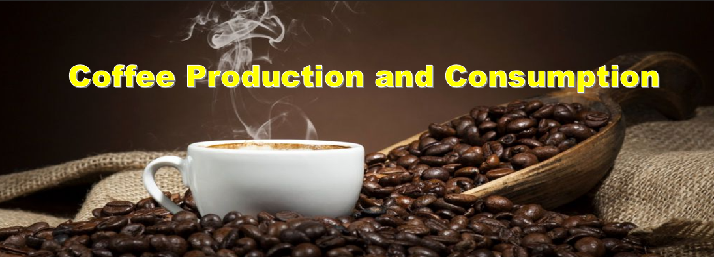

<b>

</b>

<h1><b>
Final Project Proposal: Group G
</b></h1>
<h3><b>
Contributors
</b></h3>
<h4><b>
Erik Fritzsche
</b></h4>
<h4><b>
Paul Hoogestraat
</b></h4>
<h4><b>
	Brent Sergent
</b></h4>

# Background:
Global climate has started to significantly change over the last 30 years. How will this impact sensitive crops such as coffee over time? There have been many articles speculating on the impacts global warming will have on coffee production. In 2018, a specific article included coffee in the top five most sensitive crops. While coffee consumption in the U.S. has increased by 5% since 2015, how has consumption changed in other countries.

<b>Questions to answer:</b>
1.	How has the production of coffee changed (increased, decreased) from 1990 to 2018?
2.	What are the top 10 coffee producing countries from 1990 thru 2018?
3.	Have exports from coffee producing countries increased or decreased between 1990 and 2018?
4.	Have imports for coffee increased or decreased between 1990 and 2018?
5.	How has the price for coffee beans changed between 1990 and 2018?
6.	What are the main environmental changes that threaten coffee crops?

## Resources:
-	HTML/CSS/Bootstrap
-	JavaScript	
-	Python Pandas
-	Tableau
-	Machine learning library: Scikit-Learn

## Process: 
- [x] Concept design and project planning.
- [x] Create Github Repository.
- [x] Evaluate and obtain data sources.
- [ ] Transform data into visuals
  - [ ] Chart depicitng top 10 coffee producers since 1990
  - [ ] Chart depicting top 10 coffee importers since 1990
  - [ ] Graph depicting exports and imports trends over time.
  - [ ] Graph depicting price fluctuations in retail coffee price over time
  - [ ] Map identifing coffee producing countries
  - [ ] Map identifing coffee import countries  
- [ ] Evalute, design, and deploy a machine learning model
  - [ ] Model evaluated: ?
  - [ ] Model evaluated: ?
  - [ ] Model Optimized: ?
  - [ ] Model Deployed: ?
- [ ] Design a website with the following objectives:
  - [ ] Frame objective. 
  - [ ] Employ collected data to identify trends with viusuals.
  - [ ] Create a vehical to demonstate outcome of machine learing model.
  - [ ] Final analysis
  - [ ] Refrences

# Data Sources
* [Kaggle: ICO Coffee Dataset (Worldwide)](https://www.kaggle.com/yamaerenay/ico-coffee-dataset-worldwide)

Data was obtained from ICO Coffee Dataset (Worldwide) hosted on Kaggle. This collection contained 13 csv files capturing distinct metrics regarding coffee economic data. Scope of files evaluated were : global production, global imports, inventories, prices-paid to growers, domestic consumption, and  retail prices.
<b>

</b>
# Visualizations
Data evaluated was transformed into charts and interactive visualizations employing Tableau. Final visualizations were incorporated into the website and can also be located on the public Tableau website listed below in the references. An example:

# Machine Learning
*	Using the historical export, consumption and trading/stock data for each country we can determine whether the future price of coffee beans would increase or decrease by country.
*	If the future price of coffee is increasing in the exporting countries, will there be a future price increase for coffee in the importing countries.
*	And vice versa, if the future price of coffee is decreasing in the exporting countries, will there be a future price decrease for coffee in the importing countries.
# Website
A website was developed to communicate the results of this project. The objective was to identify trends regarding coffee production by employing data visualizations and machine learning.

# Analysis

# Refrences
### Data
* [Kaggle: ICO Coffee Dataset (Worldwide)](https://www.kaggle.com/yamaerenay/ico-coffee-dataset-worldwide)

### Graphs (Tableau)
* [Coffe Producer Country Data (Tableau)](https://public.tableau.com/profile/paul.hoogestraat#!/vizhome/coffe_prodiuction_2021P3/Dashboard1?publish=yes)

* [Coffe Import Country Data (Tableau)](https://public.tableau.com/profile/paul.hoogestraat#!/vizhome/Coffe_Import_2021P3/CoffeImport?publish=yes	)

* [Coffe Trend Data (Tableau)](https://public.tableau.com/profile/paul.hoogestraat#!/vizhome/coffe_trendlines_2021P3/coffe?publish=yes)

